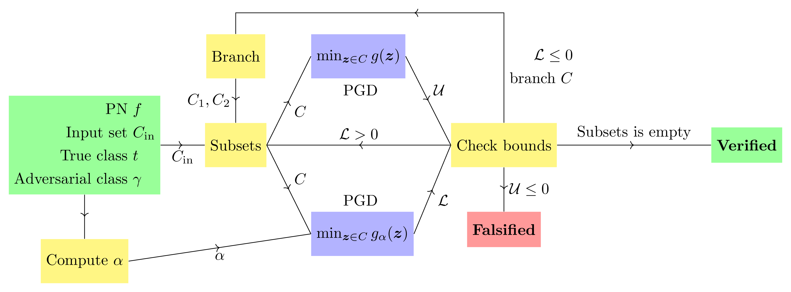

# Sound and Complete Verification of Polynomial Networks

[](./LICENSE)[](https://arxiv.org/abs/2209.07235)

Official implementation in PyTorch of the **NeurIPS'22 paper "Sound and Complete Verification of Polynomial Networks"**.



## Requirements

In order to run the experiments we need `python >= 3.7.0` to be installed. Then we can install the required python libraries with:

```
pip3 install -r requirements.txt
```

In order to run some special benchmarks, [gurobi](https://www.gurobi.com/downloads/?campaignid=2027425882&adgroupid=77414946611&creative=355014679679&keyword=gurobi&matchtype=e&gclid=CjwKCAjwi6WSBhA-EiwA6Niok7KcFMgS04sRvNaFqDpJ5biOSLToyu_OKo25zwFkgDyoh58fb4eYvhoCmcoQAvD_BwE) is needed.

## Source code

The implementation is divided in two main files: `utils_PN.py` and `utils_BaB.py`. In the former, polynomial network (PN) related classes and functions are stored, whereas the latter contains Branch and Bound methods for our verification algorithm.

Additional methods for employing [DeepT-Fast](https://dl.acm.org/doi/abs/10.1145/3453483.3454056) in the case of PNs are present in `utils_zonotopes.py`.

## Training

In order to train a PN we only need to run the script `train_PN.py` with the appropiate parameters ([*] is the default value). This is a resume of the most important parameters:

- `--data_root`: [./data] Root folder to store the desired dataset.
- `--dataset`: [MNIST] Desired dataset, one of: MNIST, CIFAR10 or STL10.
- `--output`: [./weights] Root folder where the best weights and the training log are stored.
- `--hidden_sizes`: [100] Number of dimensions in intermediate layers.
- `--degree_list`: [4] Degree of the PN.
- `--epochs`: [100] Number of training/validation epochs.

For more details run `python3 train_PN.py --help`.

## Verification

In order to verify a PN over a dataset we only need to run script `verify_PN.py`, the minimum required parameters are:

- `--weights`: Path of the PN weights.
- `--data_root`: [./data] Root folder to store the desired dataset.
- `--dataset`: Desired dataset, one of: MNIST, CIFAR10 or STL10.
- `--eps`: [0.01] Maximum allowed perturbation in infinite norm.
- `--maxtime`: [60] Maximum allowed time for each optimization problem.
- `--output`: [./verif_results] Root folder of the output verification file.
- `--bounds`: [alpha-conv] Lower bounding method to use in the Branc and Bound algorithm. One of:
    - intervals: IBP lower bound
    - zonotopes: DeepT-Fast lower bound
    - alpha-conv: Alpha-convexification lower bound
- `--alpha_method`: [L] Use the Uniform diagonal shift (L) or the Non-uniform diagonal shift (alphas) approach. Only relevant when using `--bounds alpha-conv`

For more details run `python3 verify_PN.py --help`. To run a test example with a 4th degree PN trained in MNIST (`weights/Prod_Poly_CCP_0_0_order_[4]_hidden_[100]_mnist_resize_0_best.pt`) at `epsilon=0.005` simply run `python3 verify_PN.py`.

The aforementioned code generates a `.csv` file in the form:

```
Id, True_class, Predicted_class, Logit, Epsilon, Time, Finish_code, Adversary_class, Adversary_logit, L, U, Adversary_order
0 , 7         , 7              , 13.18, 0.026  , 5.59, 1.0        ,                ,                ,  ,  ,
1 , 2         , 2              , 22.13, 0.026  , 5.34, 1.0        ,                ,                ,  ,  ,
...
18, 3         , 3              , 6.98 , 0.026  , 0.59, 0.0        , 8.0            , 5.863          , -0.301, -0.298, 2.0
```

## Cite as:

```
@inproceedings{Abad2022VPN,
  author = {Abad Rocamora, Elias and Sahin, Mehmet Fatih and Liu, Fanghui and Chrysos, Grigorios G and Cevher, Volkan},

  title = {Sound and Complete Verification of Polynomial Networks},

  booktitle = {Advances in neural information processing systems (NeurIPS)}

  year = {2022}
}
```
